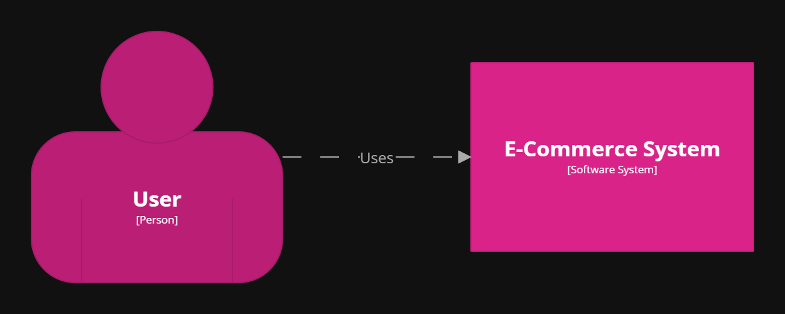
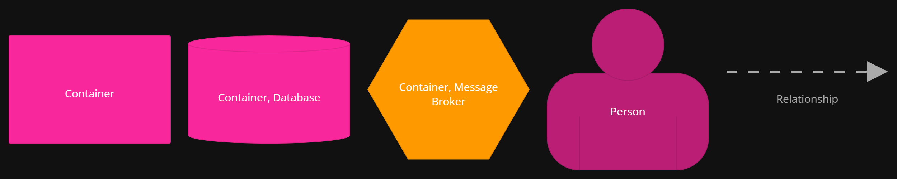
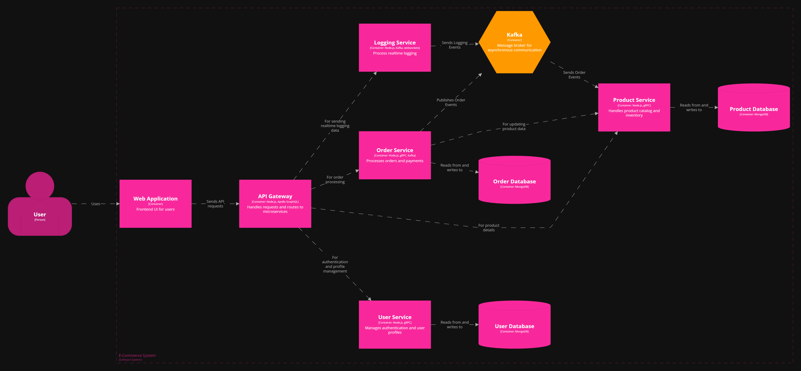

# E-Commerce System

## Table of Contents
- [E-Commerce System](#e-commerce-system)
  - [Table of Contents](#table-of-contents)
  - [Overview](#overview)
  - [Technologies Used](#technologies-used)
  - [Architecture](#architecture)
  - [C4 Model](#c4-model)
    - [System Context](#system-context)
    - [Container View](#container-view)
  - [Setup and Installation](#setup-and-installation)
    - [Prerequisites](#prerequisites)
    - [Steps to Run the Project](#steps-to-run-the-project)
  - [Usage](#usage)

## Overview
E-Commerce System is an advanced, full-stack e-commerce platform designed as a microservices-based architecture. This project was developed as part of a university assignment at **Polytechnique Sousse**.

## Technologies Used
- **Backend**: Node.js, Express.js
- **Database**: MongoDB
- **Messaging System**: Kafka
- **APIs**:
  - GraphQL
  - Protocol Buffers (ProtoBuf)
- **Frontend**: React.js
- **Containerization & Deployment**: Docker

## Architecture
This e-commerce system follows a microservices-based architecture. The key services include:
- **User Service**: Handles authentication and user management.
- **Product Service**: Manages product catalog.
- **Order Service**: Processes orders and transactions.
- **Payment Service**: Manages payments and transactions.
- **Notification Service**: Sends order updates and promotional notifications.
- **Logging Service**: Handles real time data logging
- **API Gateway**: Serves as a single entry point for client requests, using GraphQL and Protocol Buffers for communication.

## C4 Model
The system architecture is illustrated using the **C4 model** diagrams:

### System Context
Provides a high-level view of all system interactions:



### Container View
Shows the major containers and how they communicate:




These diagrams provide a clear understanding of how different components interact within the system.

## Setup and Installation
### Prerequisites
- Install **Node.js** and **npm**
- Install **Docker**

### Steps to Run the Project
1. Clone the repository:
   ```sh
   git clone https://github.com/your-repo/ecommerce-system.git
   cd ecommerce-system
   ```
2. Install dependencies:
   ```sh
   npm install
   ```
3. Start Docker:
   ```sh
    docker-compose up # (-d for detached)
   ```
4. Start the services:
   ```sh
   npm start
   ```
5. Access the API via GraphQL Apollo Playground or any API testing tool.

## Usage
- Browse and add products to the cart.
- Register and log in as a user.
- Place orders and proceed to checkout.


